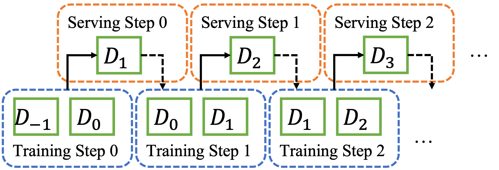

## Summary

We publish these real industry data sets across various domains from one of the largest web services companies in Korea. The dataset is crawled from the user-item interaction log at specific intervals.

Each dataset is a sequence of matrices based on a specific period. The matrix is formed in [Matrix Market](https://math.nist.gov/MatrixMarket/formats.html) format.


Training data and evaluation data are designed to form cycles, which is described as follows.   


If it is explained based on one interval, matrix data was created as logs for various periods of training data, and matrix data was created as evaluation data from data after the training data period. In the next section, training data includes the past evaluation data period, and in the current section, new evaluation data is generated with data after the training data period. In this way, a data set was generated as a matrix sequence of training and evaluation data at 8 intervals per cycle.

```
{A Service}
├── train-matrix
│   ├── 0
│   ├── 1
│   ├── 2
...
│   └── 8
└── validation-matrix
    ├── 0
    ├── 1
    ├── 2
    ...
    └── 8
```

> Note that Each time period denotes one days other than Article domain. In Article domain, each time period denotes 4 hours.

An interval contains a matrix with [Matrix Market](https://math.nist.gov/MatrixMarket/formats.html) format, and files containing user ID and item ID information. The actual pseudonymized id values in the `uid` and `iid` files are written to the lines corresponding to the id values of users and entries used in the Matrix Martix format.
```
{A Service/[train|validation]-matrix}
└── {interval-index}
    ├── iid
    ├── main.mtx
    └── uid
```

> Please note that datasets are item click logs, not purchase information. Additionally, users/products are pseudonymized with random numbers to avoid restoration.

## Download Link
Datasets are publicly available for download at [link: https://kko.to/data-sigir2023](https://kko.to/data-sigir2023)

## Citation

To acknowledge use of the dataset in publications, please cite the following paper:

Hyunsung Lee*, Sungwook Yoo*, Dongjun Lee, and Jaekwang Kim. **How Important is Periodic Model Update in Recommender Systems?** In Proceedings of the 46th International ACM SIGIR Conference on Research and Development in Information Retrieval (SIGIR ’23), July 23–27, 2023, Taipei, Tai-wan. https://doi.org/10.1145/3539618.3591934

## Article

### Description

This dataset consists of click logs collected from the home feed of articles such as news and other kinds of web pages in South Korea. Please note that the time period for each interval in Article is 4 hours. This is because, in Article domain, old items become obsolete fast.

## Blog

### Description

This dataset consists of click logs from a blog service. The logs contain click logs of recommended blog postings from users presented on the main page of the web page of the service.

## Comics

### Description

This dataset consists of click logs from a comics service. New episodes of comics are uploaded mostly once a week. Different comics are updated on different weekdays.

## Commerce

### Description
This domain is to buy gifts for other people in a social network service. Logs contain view logs of users to items. 

## Statistics of Datasets

The Average Data statistics of different domains over different time periods are as follows. We only include statistics of average values over training datasets and validation datasets. Dataset characteristics do not show abrupt changes in different time periods.

|domain|log_type|users|items|interactions|sparsity|
|---|-------|------|-----|------------|--------|		
|article|train|493.9K|14.2K|117.8M|0.2544|
|article|validation|	193.2K	|3.9K | 2.39M |0.3150|
|blog|	train|	54.5K|	164.5K	| 515K |	0.0057|
|blog|validation|	6.3K|	32.6K|	52K	|0.0262|
|comics|train|	279.2K|	1.65K|	2819K	|0.6120|
|comics|validation|77.6K|	1.6K|	471K	|0.3796|
|commerce	|train|	779.1K|	278.9K	|5560K|	0.0026|
|commerce|validation|58.3K|	93.1K|	329K	|0.0061|

## License

This is a statement regarding the license to release the dataset. The following bullet points outline the terms and conditions of use:

* Ownership: Kakao Corporation is the rightful owner of the dataset.
Availability: The dataset is available for non-commercial use only.
* User's responsibilities: The user is responsible for following all copyright and legal regulations when using the dataset.
* Prior approval: If the dataset is being used for commercial purposes or being cited or redistributed, it requires approval from Kakao Corporation.
* Accuracy: Kakao Corporation does not guarantee the accuracy, suitability, or validity of the dataset for any other purpose.
* No warranties: Kakao Corporation provides no warranties or representations regarding the dataset, and the user may not indicate any endorsement from the company.
* Limitation of liability: The user assumes all responsibility for using the dataset and is solely responsible for any consequences arising from its use. Kakao Corporation is exempted from liability for use.
* The user must acknowledge the use of the data set in publications resulting from the use of the data set (see the citation information above).
